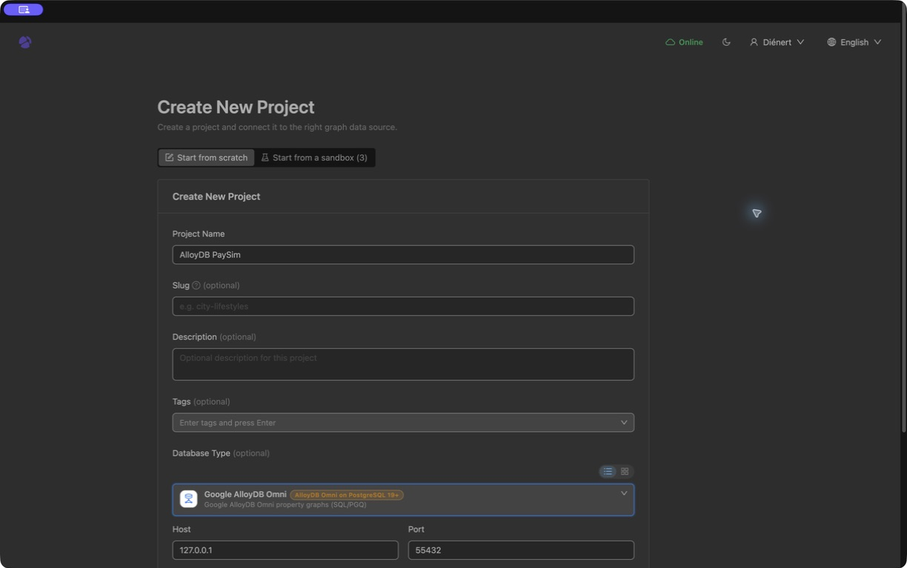
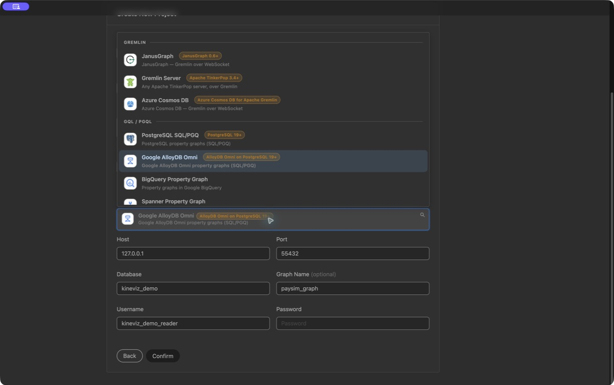
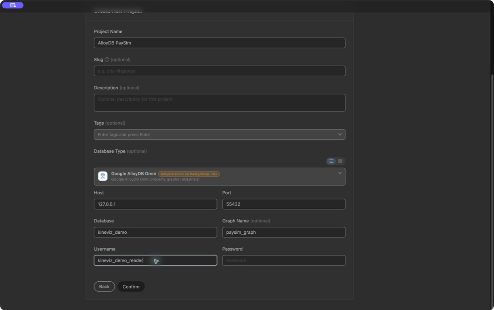

# Connect Kineviz Desktop directly to AlloyDB Omni

Use **Create New Project → Google AlloyDB Omni**. This replaces the Spanner
example's database-proxy workflow. Do **not** start `graphxr-database-proxy`, choose
Database Proxy, paste an API URL, or configure the SQL import panel.

## 1. Confirm the database build and graph

The native connector needs the **PostgreSQL 19 SQL/PGQ build of AlloyDB Omni**.
The standard Omni 16.x image is not compatible. Use the pinned preview image and
setup in the [root quick start](../README.md#quick-start):

```bash
./gxr start
```

Verification must report **13,666 nodes**, **25,266 edges**, **8 shared identifier
values** and **4 shared values connected by a direct transfer**. The four values
belong to one planted four-account ring—not four rings. For an actors-only replay
start, use the separate [streaming instructions](../streaming/README.md).

If you already have a compatible AlloyDB Omni instance, skip `start` and point
`.env` at a **dedicated demo database**, with an account allowed to create its
demo schemas. Use `./gxr up <demo>` to load and verify it. Do not run these loaders against production tables. Probe your
server first:

```sql
SELECT version(), current_setting('server_version_num');
SELECT property_graph_schema, property_graph_name
FROM information_schema.property_graphs;
```

Graph storage in this repo is namespaced. Desktop 0.19.0 takes the **graph name**,
not a `schema.graph` pair. Its login's `search_path` must include the graph schema.
The reader helper below sets this for the Desktop login. Graph names must be
unique across that database.

## 2. Download the current Desktop release from kineviz.com

1. Open **[kineviz.com](https://kineviz.com)**.
2. Click **Download Kineviz Desktop** and choose your OS and architecture.
3. Install, launch, and sign in yourself. Do not share your account credentials.

The latest release checked for this guide was **[v0.19.0](https://github.com/Kineviz/kineviz-desktop/releases/tag/v0.19.0)**,
published September 4, 2026. Its release notes introduce the Google AlloyDB Omni
connector. Recheck the website or [latest release](https://github.com/Kineviz/kineviz-desktop/releases/latest)
for updates; do not carry over the Spanner repo's older minimum version.

| Platform | Verified v0.19.0 installer |
|---|---|
| macOS Apple Silicon | [mac-arm64.dmg](https://github.com/Kineviz/kineviz-desktop/releases/download/v0.19.0/Kineviz-Desktop-0.19.0-mac-arm64.dmg) |
| macOS Intel | [mac-x64.dmg](https://github.com/Kineviz/kineviz-desktop/releases/download/v0.19.0/Kineviz-Desktop-0.19.0-mac-x64.dmg) |
| Windows x64 | [Setup-win-x64.exe](https://github.com/Kineviz/kineviz-desktop/releases/download/v0.19.0/Kineviz-Desktop-Setup-0.19.0-win-x64.exe) |
| Windows ARM64 | [Setup-win-arm64.exe](https://github.com/Kineviz/kineviz-desktop/releases/download/v0.19.0/Kineviz-Desktop-Setup-0.19.0-win-arm64.exe) |
| Linux x86-64 | [linux-x86_64.AppImage](https://github.com/Kineviz/kineviz-desktop/releases/download/v0.19.0/Kineviz-Desktop-0.19.0-linux-x86_64.AppImage) |
| Linux ARM64 | [linux-arm64.AppImage](https://github.com/Kineviz/kineviz-desktop/releases/download/v0.19.0/Kineviz-Desktop-0.19.0-linux-arm64.AppImage) |

The Desktop architecture and database-image architecture are different choices:
the pinned database preview is x86-64 even when Desktop runs natively on ARM.

## 3. Create a read-only database login

**`./gxr start` already performs this step.** For a separately configured database,
after loading the demos you want to explore:

```bash
.venv/bin/python tools/create_reader.py
.venv/bin/python tools/check_reader.py
```

This creates `kineviz_demo_reader`, grants SELECT on the installed demo graphs
and their backing relations, and writes its generated password to the ignored
`secrets/reader.env` file (permissions 600). It does not change your admin password
and reuses an existing reader only if its saved credentials authenticate. It
refuses to replace a role with missing credentials. Keep the writer credentials in `.env`
for loading/replay; use the reader credentials in Desktop.

If you add another demo with `start`, its repo-owned schema, tables and graph are
granted to the reader and its database-specific `search_path` is updated. With
the lower-level `up` command, rerun the reader helper above. It never rotates the
password or grants access to unrelated schemas. After an explicitly requested
reset, rerun setup to rebuild the graph and restore its reader grants.

## 4. Create the project

These controls were inspected in **Desktop 0.19.0**:

1. From the Projects page click **New project**.
2. Choose **Start from scratch**.
3. Enter Project Name, for example **AlloyDB PaySim**.
4. In **Database Type**, search for **AlloyDB**, or scroll to **GQL / PGQL**.
5. Select **Google AlloyDB Omni**. Its description says **AlloyDB Omni on PostgreSQL 19+**.
6. Fill in:

| Field | This repo's local defaults |
|---|---|
| Host | `127.0.0.1` (no `http://` and no port in this field) |
| Port | `55432` (the published host port, not container port 5432) |
| Database | `kineviz_demo` |
| Graph Name (optional) | `paysim_graph` |
| Username | `kineviz_demo_reader` |
| Password | The value of `PGPASSWORD` in `secrets/reader.env` |

7. Click **Confirm**. If you encounter a database error, resolve it before
   continuing; seeing a project card alone is not proof that it connected.
8. Open the project and inspect its **Schema Vis** / categories and relationships.
   PaySim should expose seven node labels and seven relationship labels:
   `client`, `merchant`, `bank`, `email`, `phonenumber`, `ssn`, `transaction`;
   `has_email`, `has_phone`, `has_ssn`, `performs`, `to_client`, `to_merchant`, `to_bank`.

For the other demos use graph `fraud_graph` or `fleet_graph`. Specify Graph Name
whenever the database contains more than one graph; auto-detection then becomes
ambiguous.

### Connection setup screenshots

Captured in Kineviz Desktop **0.19.0** on September 5, 2026. These show the
unsubmitted setup form, not a verified connection. The password is intentionally
blank; use your own reader password before clicking **Confirm**.

**Start from scratch and name the project.**



**Choose Google AlloyDB Omni under GQL / PGQL.** The connector requires
PostgreSQL 19+; it is not the PostgreSQL table-import workflow.



**Enter the local connection settings.** Keep the host and port in separate
fields, and specify `paysim_graph` for the PaySim demo.



## 5. Verify a live graph query and expansion

In the project's **Query** panel—not its SQL import tab—run:

```sql
SELECT * FROM GRAPH_TABLE (
  paysim_graph MATCH (a IS client)-[p IS performs]->(t IS transaction)-[d IS to_client]->(b IS client)
  COLUMNS (*)
) LIMIT 100;
```

`COLUMNS (*)` is **Kineviz graph-mode shorthand**: the connector expands it into
node/edge results. It is not SQL you can paste unchanged into psql. Queries for
direct database execution use explicit columns in
[`queries/pgq/`](../demos/paysim-schemaless/queries/pgq/).

Confirm that the canvas contains **clients connected through transaction nodes**,
not merely a result table. Select a client and use **Expand** to fetch additional
relationships. A successful query plus expansion is the final connection check.
If you see only a scalar table, use the graph-mode query above.

During a replay, rerun the query or refresh a configured dashboard. The database
graph reads current rows, but an existing canvas does not automatically subscribe
to every insert. Do not import the old Spanner project or GQL dashboard unchanged.

## Connecting from another host

The default listener is intentionally loopback-only. For a remote preview host,
use an approved private tunnel rather than exposing its database port publicly.
For example, if the remote Compose deployment publishes port 55432 on loopback:

```bash
ssh -N -L 55432:127.0.0.1:55432 your-user@your-preview-host
```

Leave SSH running and keep Desktop Host `127.0.0.1`, Port `55432`. Ensure the local
port is free; do not run the local Compose service on the same port. Follow your
organization's authentication/network policy. The v0.19.0 project form inspected
here exposes no TLS configuration fields, so this guide does not instruct a
plaintext connection across an untrusted network.

Hosted Kineviz and [Kineviz Enterprise](https://kineviz.com/enterprise) run on
different hosts: `127.0.0.1` there is not your laptop. Plan the server-to-database
network route with your administrator. Managed AlloyDB without SQL/PGQ is not a
drop-in replacement for this native graph workflow.
